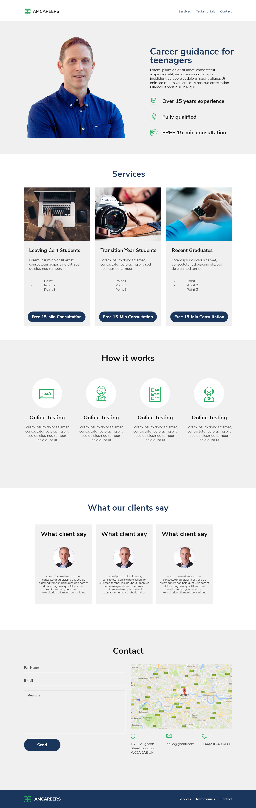
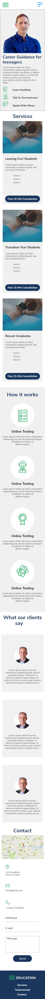

# AM Careers
(Developer: Anthony Murray)

[Live Site](https://anthony-murray.github.io/code_institute_p1_amcareers/)

This is the website for a Career Guidance Consultancy. It will provide prospective customers with details about services that I offer, my experience and encourage users to book an appointment. It is designed in an easy to navigate one-page format.

## Table of Contents

1.  [Project Goals](#project-goals)

1.  [Business Goals](#business-goals)

2.  [User Goals](#user-goals)

2.  [User Experience](#user-experience)

1.  [Target Audience](#target-audience)

2.  [User Requirements and Expectations](#user-requirements-and-expectations)

3.  [User Stories](#user-stories)

3.  [Design](#design)

1.  [Design Choices](#design-choices)

2.  [Colours](#colours)

3.  [Fonts](#fonts)

4.  [Structure](#structure)

5.  [Wireframes](#wireframes)

1.  [Desktop](#desktop-wireframe)

2.  [Mobile](#mobile-wireframe)

4.  [Technologies Used](#technologies-used)

1.  [Languages](#languages)

2.  [Frameworks & Tools](#frameworks--tools)

5.  [Features](#features)

1.  [Existing Features](#existing-feature)

2.  [Features Left to Implement](#features-left-to-implement)

6.  [Testing](#testing)

1.  [HTML Validation](#HTML-validation)

2.  [CSS Validation](#CSS-validation)

3.  [Accessibility](#accessibility)

4.  [Performance](#performance)

5.  [Device testing](#device-testing)

6.  [Browser compatibility](#browser-compatability)

7.  [Testing user stories](#testing-user-stories)

8.  [Bugs](#Bugs)

9.  [Deployment](#deployment)

10.  [Credits](#credits)

11.  [Acknowledgements](#acknowledgements)

  

## Project Goals

The goals of this website include:

  

### Business Goals

- Generate quality leads

- Build brand awareness

- Build trust in potential clients by communicating the expertise, experience and previous client succes stories of the career guidance consultant

- Design a fast, accesible, SEO-optimised website with compelling content that answers the searcher’s query whilst focusing on the user experience to increase our organic search visibility

  

### User Goals

- Find a career guidance consultant that they can trust

- Understand the services provided and cost

- Establish credibility of consultants claims and that they can deliver an excellent service

- Contact the consultant to request more details on the services provided through multiple channels

  

[Back to Table of Contents](#table-of-contents)

  

## User Experience

  

### Target Audience

- Parents and guardians of teenagers / recent graduates seeking career guidance.

  

### User Requirements and Expectations

- A professional, simple, clear design

- Easy naviagation regardless of device

- A responsive website

- A website that is quick to load

- Quality content

- Accessible to all users

  

### User Stories

I have divided my user stories into prospective customers, returning customers and business owener as each of these users will have a distinct set of needs and goals.

  

#### Prospective Customers

Need to understand the main purpose of the site and learn more about the consultant and see evidence of expertise.

Need to be able to easily navigate the site to find relevant content quickly.

Need to see a list of the services offered by the consultant so they make a decision on whether or not they can meet their needs.

Need to look for evidence in the form of testimonials to understand what previous clients experience was and if they are trusted.

Need evidence or social proof by being able to engage with social media links to see their followings on social media.

Need the ability to contact the consultantto to submit queries or further informatiostion requests (without feeling like they are committing to purchasing).

Need the ability to be able to schedule an appointment.

Need the ability to be able to contact the consultant through multiple channels (email, phone etc.)

Need condimration that see a confirmation that my contact form has been submitted and be able to navigate back to the main site.

  

#### Existing / Returning Customers

  

As an existing customer, I want to locate the consultant's contact details or reach out to them directly through the website so I can request assistance, refer to other poptental clients, see additional services offered.

As an existing customer, I need condimration that see a confirmation that my contact form has been submitted and be able to navigate back to the main site.

  

#### Business Owner

As a business owner, I want users to be able to see what services I offer so that they can determine if they are interested in them.

As a business owner, I want users to see a list of client testimonials to build trust in my brand and services.

As a business owner, I want users to be able to contact me directly through the website.

As the business owner, I want to make sure users are directed back to the index page of the website and do not use their browser's back button should they come across a 404 page not found error.

  

[Back to Table of Contents](#table-of-contents)

  

## Design

  

### Design Choices

I researched other careers education / consultancy websites to for inspiration focusing on find a professional, responsive and clean layouts that aligned to my own vision. I based my site design on the layout of [The Code Insititutes](https://codeinstitute.net/ie/) website. Although there are some examples of career coaching websites most (in my oponion) are pporly designed.

  

Engaging with parents to grab their attention needs to be done quickly. The imagery used on the site was chosen to grab their attention focusing on teenagers contempleating. The hero section includes a picture of the consultant to proivide proof and early evidence that there is a face behind the brand.

  

At the wireframing stage I decided to adopt a mobile first approach after reading this excellent article on [Browser Stack.](https://www.browserstack.com/guide/how-to-implement-mobile-first-design)

  

### Colours

Colour psychology plays an important role in webdesign. In choosing a colour combination I decided on blue and white on reading of the following article on [Medium.com](https://medium.com/@bloominari/color-psychology-in-web-design-f60656b8f313). Recognising the importance of having a AAA compliant palette as recommended by the WCAG I choose #1b365d as the base colour as recommended here by the [University of Sussex](http://www.sussex.ac.uk/tel/resource/tel_website/accessiblecontrast/?q=FFFFFF~003b49~1d4289~94a596~e56db1~d3273e~00bfb2~d6d2c4~ffc845~dc582a~41b6e6~1b365d~be84a3~5d3754~7da1c4~f2c75c~d0d3d4~007a78~000000)

  

Primary Colours - Blue #1B365D / White #FFFFFF

Backgrounds - Light Grey #F0F0F0

Body Text - Black #1A1A1A

Button Hover - Dark Blue #101E39

  

These combinations were tested using [WebAIM's Contrast Checker tool](https://webaim.org/resources/contrastchecker/).

  

  

### Fonts

Oswald and Source Sans Pro were selected with the help of the [Font Pair](https://www.fontpair.co/all).

  

Oswald font is used for site headings and Source Sans Pro for the main body text. Both fonts use a sans-serif fallback.

  

### Structure

The primary website follows a one-page design divided into unique sections. The sections are as follows:

  

- A header section containing the business logo and responsive navigation menu.

- A hero section containing a description and image to convey the purpose of the site. An image of the consultant is used to build trust with the visitor. A call to action button is included to encourage the user to contact for a free 15 minute consulation which directs to the contact form.

- A services section to provide brief descriptions of the services the consultant provides and a call to action button to encourage the user to contact the consultant for a no obligation consultation which directs to the contact form.

- A client testimonials section to provide evidence of the consultant's expertise and build trust with the visitor.

- A contact section which provides a contact form to allow the user to contact the consultant with questions or to request a quote, a Google map displaying the consultant's location and further contact details including a phone number and email address.

- A footer section which social media links, copyright notice, and a link to the site owner's GitHub page.

  

### Wireframes

I used Adobe XD to create my wireframes. I created wireframes for mobile and desktop. I used the mobile first approach to design the site.

#### Desktop Wireframe

#### Mobile Wireframe

  

## Technologies Used

  

### Languages

- HTML

- CSS

  

### Frameworks & Tools

-  [Git](https://git-scm.com/)

-  [GitHub](https://github.com/)

-  [VSCode](https://code.visualstudio.com/)

-  [Adope XD](https://www.adobe.com/ie/products/xd.html)

-  [Adobe Express](https://www.adobe.com/ie/express)

-  [Google Fonts](https://fonts.google.com/)

-  [Font Awesome](https://fontawesome.com/)

-  [Favicon.cc - favicon generator](https://www.favicon.cc/)

-  [Am I Responsive](http://ami.responsivedesign.is/)

-  [Google Maps](https://www.google.com/maps)

-  [Placehold - placeholder image generator](https://placehold.co/)

-  [Venngage's Accessible color palette generator](https://venngage.com/tools/accessible-color-palette-generator)

-  [WebAIM's Contrast Checker tool](https://webaim.org/resources/contrastchecker/)

-  [Font Pair](https://www.fontpair.co/all)

-  [W3C Markup Validation Service](https://validator.w3.org/)

-  [W3C CSS Validation Service](https://jigsaw.w3.org/css-validator/)

-  [WAVE web accessibility evaluation tool](https://wave.webaim.org/)

-  [Google Lighthouse](https://developer.chrome.com/docs/lighthouse/overview/)

  

[Back to Table of Contents](#table-of-contents)

  

## Features

The website consists of three pages in total, an index page, a form confirmation page, and a 404 page. The site's pages contain X distinct features:

  

### Existing Features

  

### Logo and Navigation Bar

- featured on all pages

- containing the business logo, a responsive navigation menu.

- navigation links direct the user to the relevant section of the page.

- navigation links are highlighted when hovered over.

  

### Hero Section

- A hero section containing a description and image to convey the purpose of the site. An image of the consultant is used to build trust with the visitor. A call to action button is included to encourage the user to contact for a free 15 minute consulation which directs to the contact form.

- The 404 page contains a link to the home page.

- On the form confirmation page, the user is provided with a link to the home page.

  

  

### Services Section

- Provides brief descriptions of the services the consultant provides and a call to action button to encourage the user to contact the consultant for a no obligation consultation which directs to the contact form. Strong imagery is used to convey the purpose of the services provided.

  

  

### How it works Section

- Provides a brief description of how the consultant works with clients

- Provides a video which provides further information on how the consultant works with clients and evidence of the platform used to deliver the service.

  

  

### Client Testimonials Section

- To provide evidence of the consultant's expertise and build trust with the visitor.

  

  

### Contact Me Section

- A contact form to allow the user to contact the consultant requesting a free 15 minute consultation or to request a quote.

- A Google map displaying the consultant's location allowing the visitor to get the consultant's address, view a map of the location and directions to their location.

- Further contact details including a phone number and email address.

  

  

### Footer

- which displays the social media links, a link to the site owner's GitHub page, and a link to the site owner's LinkedIn page.

- The footer is displayed on all pages.

  

  

### Form Submission Confirmation Page

- Displays a thank you message to the user for contacting the consultant.

- The navigation bar is displayed to allow the user to navigate to the other pages on the site.

- The footer is displayed to allow the user to engage with social media links and navigate to the site owner's GitHub and LinkedIn pages.

  

  

### 404 Page

- Displays a 404 page not found message, a back to homepage link.

- The navigation bar is displayed to allow the user to navigate to the other pages on the site.

- The footer is displayed to allow the user to engage with social media links and navigate to the site owner's GitHub and LinkedIn pages.

  

  

### Features Left to Implement

The following features could be implemented in the future to provide users with more detailed information and further build prospective client trust through the website:

  

- To improve SEO each service could have its own page with more detailed information about the service and the benefits of the service to the client. This would also allow the consultant to target more keywords related to each service.

- A Blog feature could further build trust with prospective clients by allowing the consultant to share articles related to career guidance and coaching. This would also benefit SEO.

- A FAQ section could be added to answer common questions.

- A chatbot could be added to improve user experience

- A hamburger menu could be added to improve user experience on mobile devices (I tried to implement this through CSS but there were signigcant accseability issues).

- The CTA button on the hero section should have centered on smaller devices. I tried to implement this through CSS but was constrained by time.

  

[Back to Table of Contents](#table-of-contents)

  

## Testing

  

### HTML Validation

The W3C Markup Validation Service was used to validate the HTML of the website. All pages pass with no errors and no warnings shown.

  

- index.html [results](https://validator.w3.org/nu/?doc=https%3A%2F%2Fanthony-murray.github.io%2Fcode_institute_p1_amcareers%2F)

- form.html [results](https://validator.w3.org/nu/?doc=https%3A%2F%2Fanthony-murray.github.io%2Fcode_institute_p1_amcareers%2Fform)

- 404.html results [results](https://validator.w3.org/nu/?doc=https%3A%2F%2Fanthony-murray.github.io%2Fcode_institute_p1_amcareers%2F404)

  

### CSS Validation

The W3C Jigsaw CSS Validation Service was used to validate the CSS of the website.

  

- styles.css [results](https://jigsaw.w3.org/css-validator/validator?uri=https%3A%2F%2Fanthony-murray.github.io%2Fcode_institute_p1_amcareers%2F&profile=css3svg&usermedium=all&warning=1&vextwarning=&lang=en)

  

### Accessibility

The WAVE WebAIM web accessibility evaluation tool was used to ensure the website is accessible to users with disabilities. The following pages were tested:

  

- index.html [results](https://wave.webaim.org/report#/https://anthony-murray.github.io/code_institute_p1_amcareers/)

- form.html [results](https://wave.webaim.org/report#/https://anthony-murray.github.io/code_institute_p1_amcareers/form)

- 404.html results [results](https://wave.webaim.org/report#/https://anthony-murray.github.io/code_institute_p1_amcareers/404)

  

### Performance

Google Lighthouse in Google's Chrome Developer Tools was used in ingconito mode to test the performance of the website. The following pages were tested:

  

### Index

Mobile

Desktop

  

### Form

Mobile

Desktop

  

### 404

Mobile

Desktop

  

### Device testing

The website was tested on the following devices:

- Dell Latitude 5520 Laptop

- Hauwei P10 Pro

- iPhone 12 Pro Max

- iPad Pro 12.9

  

In addition, the website was tested using Google Chrome Developer Tools simulating all available device options.

  

### Browser compatibility

The website was tested on the following browsers:

- Google Chrome Version Version 114.0.5735.134 (Official Build) (64-bit)

- Mozilla Firefox Version Version 68.9.0esr (32-bit)

- Microsoft Edge Version Version 114.0.1823.58 (Official build) (64-bit)

  

### Testing user stories

#### Prospective Customers

  

Need to understand the main purpose of the site and learn more about the consultant and see evidence of expertise.

- The site opens quickly and is easily navigable. The hero section clearly states the purpose of the site and contains a CTA. Works on all devices and browsers tested.

  

Need to be able to easily navigate the site to find relevant content quickly.

- The navigation bar is clearly visible and works on all devices and browsers tested. Links are clearly labelled and work as expected directing the user to the relevant sections of the site.

  

Need to see a list of the services offered by the consultant so they make a decision on whether or not they can meet their needs.

- The services section is clearly visible and works on all devices and browsers tested. The services are clearly labelled and the user can click on the service to be taken to the contact me section where they can submit a query or contact the consultant directly.

- The How it Works section indicates the steps in the process and provide video evidence of the process and platform used. The iframe caused some issues in performance testing but was deemed necessary to provide evidence of the process (see bugs section). The video is clearly labelled and works on all devices and browsers tested.

  

Need to look for evidence in the form of testimonials to understand what previous clients experience was and if they are trusted.

- The testimonials section is clearly visible and works on all devices and browsers tested. The testimonials are clearly labelled.

  

Need evidence or social proof by being able to engage with social media links to see their followings on social media.

- The social media links are clearly visible and work on all devices and browsers tested. The links are clearly labelled and work as expected.

  

Need the ability to contact the consultantto to submit queries or further information requests (without feeling like they are committing to purchasing).

Need the ability to be able to schedule an appointment.

Need the ability to be able to contact the consultant through multiple channels (email, phone etc.

- The contact form is clearly visible and works on all devices and browsers tested. The form is clearly labelled and works as expected.

- Further contact information is available in the Contact Me section and works on all devices and browsers tested.

  

Need condimration that see a confirmation that my contact form has been submitted and be able to navigate back to the main site.4

- Once contact details have been submitted, the user is redirected to a confirmation page. The user can navigate back to the main site using the navigation bar.

  

#### Existing Customers

As an existing customer, I want to locate the consultant's contact details or reach out to them directly through the website so I can request assistance, refer to other poptental clients, see additional services offered.

As an existing customer, I need condimration that see a confirmation that my contact form has been submitted and be able to navigate back to the main site.

- The contact form is clearly visible and works on all devices and browsers tested. The form is clearly labelled and works as expected.

- Further contact information is available in the Contact Me section and works on all devices and browsers tested.

- When the user submits the contact form, they are redirected to a confirmation page. The user can navigate back to the main site using the navigation bar.

- Social media links are clearly visible and work on all devices and browsers tested. The links are clearly labelled and work as expected and are available on all pages

  

#### Business Owner

  

As a business owner, I want users to be able to see what services I offer so that they can determine if they are interested in them.

- The services section is clearly visible and works on all devices and browsers tested. The services are clearly labelled and the user can click on the service to be taken to the contact me section where they can submit a query or contact the consultant directly.

- Further information is available in the How it Works section and works on all devices and browsers tested. The section is clearly labelled and works as expected.

As a business owner, I want users to see a list of client testimonials to build trust in my brand and services.

- The testimonials section is clearly visible and works on all devices and browsers tested. The testimonials are clearly labelled.

As a business owner, I want users to be able to contact me directly through the website.

- The contact form is clearly visible and works on all devices and browsers tested. The form is clearly labelled and works as expected.

As the business owner, I want to make sure users are directed back to the index page of the website and do not use their browser's back button should they come across a 404 page not found error.

- The 404 page contains a link to the index page of the website and works on all devices and browsers tested. The link is clearly labelled and works as expected. Furthermore naviation links are available on all pages.

  

[Back to Table of Contents](#table-of-contents)

  

## Known bugs

- The iframe in the How it Works section caused some issues in performance testing but was deemed necessary to provide evidence of the process. I was unable to use a facade although I tried several different options and resources. I also tried to use a placeholder image but this did not work either. I have included the following resources in my research:

- https://web.dev/embed-best-practices/forlazyloading

- https://www.makeuseof.com/tag/force-subtitles-embedded-youtube-video

- https://css-tricks.com/lazy-load-embedded-youtube-videos

- https://web.dev/embed-best-practices

- https://stackoverflow.com/questions/59608884

  
  

[Back to Table of Contents](#table-of-contents)

  

## Deployment

The website was deployed using GitHub Pages by following these steps:

1. In the GitHub repository navigate to the Settings tab

2. On the left-hand menu select Pages

3. For the source select Branch: Main

4. When the webpage refreshes automatically a notification appears stating that the site is live at https://anthony-murray.github.io/code_institute_p1_amcareers

  

To fork the repository follow these steps:

1. Go to the GitHub repository https://github.com/Anthony-Murray/code_institute_p1_amcareers

2. Click on Fork button in the upper right-hand corner

  

To clone the repository by following these steps:

1. Go to the GitHub repository https://github.com/Anthony-Murray/code_institute_p1_amcareers

2. Locate the Code button on the the top right right hand corner above the list of files and click it

3. Select your preferred method of cloning the repository from the dropdown menu. The options are HTTPS, SSH and GitHub CLI.

4. If you are using HTTPS copy the link provided. If you are using SSH click the Use SSH button and copy the link provided. If you are using GitHub CLI click the Use GitHub CLI button and copy the link provided.

5. Open Git Bash

6. Change the current working directory to the location where you want the cloned directory to be made.

7. Type git clone, and then paste the URL you copied earlier.

8. Press Enter to create your local clone.

  

[Back to Table of Contents](#table-of-contents)

  

## Credits

Images and logos not referenced below are owned or created by the developer.

  
### Media

Logo

- The logo was created using Adobe Express and is owned by the developer.

  

Testimonial Images:

- All images were sourced from https://www.pexels.com/ and are free to use without attribution.

 Wireframes
 - Purchased at https://www.behance.net/gallery/49354509/Adobe-XD-Freebie-EDUCATION

### Code

In order of appearance:

#### Navigation Menu

- Navigation bar designed using flexbox as recommmend during stand up sessions.Due to accesability issues I did will not implement a CSS only solution for a mobile hamburger menu. See the following article https://www.sitepoint.com/community/t/checkbox-hack-and-hiding-the-input-element/378398

- https://css-tricks.com/snippets/css/a-guide-to-flexbox/

- https://stackoverflow.com/questions/4740122 align-logo-on-the-left-and-navigation-links-on-the-right-using-flexbox

- https://codepen.io/alvarotrigo/pen/MWEJEWG

- https://freshman.tech/flexbox-navbar/

- Firefox browser would not display logo image in navigation bar. Resolved using https://support.mozilla.org/en-US/questions/1209125

- https://blog.logrocket.com/the-elements-of-responsive-typography/

  

####  Hero Section - Primarliy used CSS grid.

- https://www.freecodecamp.org/news/css-grid-tutorial-with-cheatsheet/

- https://www.freecodecamp.org/news/how-to-make-a-landing-page-with-html-css-and-javascript/

- https://www.w3schools.com/css/css_grid.asp

- https://www.w3schools.com/css/css_grid_container.asp

- https://www.freecodecamp.org/news web-layouts-use-css-grid-and-flex-to-create-responsive-webpages/

- Flexbox or grid - How to decide? https://www.youtube.com/watch?v=3elGSZSWTbM

- How to build a simple responsive layout with CSS grid https://www.youtube.com/watch?v=PNK6VGFquao

- https://wpengine.com/resources/combine-flexbox-and-css-grids-for-layouts-how-to/

- https://blog.logrocket.com/css-grid-guide/

- https://css-tricks.com/look-ma-no-media-queries-responsive-layouts-using-css-grid/

####  Services Section - Primarliy used CSS grid / Flex

- https://www.w3schools.com/css/css3_flexbox_container.asp

- https://flexbox.ninja/demos/same-height-columns/

- https://daily-dev-tips.com/posts/css-equal-height-columns/

- https://wpengine.com/resources/combine-flexbox-and-css-grids-for-layouts-how-to/

- https://labs.jensimmons.com/

- https://uxplanet.org/challenge-005-3-column-preview-card-component-6c9b4e797f98

- https://codepen.io/gregrickaby/pen/pVmgGX

  

#### How it works Section

- Most of the above resources were used for this section as well.

- https://web.dev/lazy-loading-best-practices/

- https://stackoverflow.com/questions/59608884/how-to-lazy-load-a-youtube-video-embedded-on-an-iframe

  

#### Testimonials Section

- Most of the above resources were used for this section as well.

- Code from the Love Running Walkthrough project was used as a reference for the testimonial section in particular the circular image design and layout.

  

####  Contact Me Section

- Most of the above resources were used for this section as well.

- https://www.w3schools.com/howto/howto_css_contact_form.asp

- Code from the Love Running Walkthrough project was used as a reference for the contact me section

- http://www.prepbootstrap.com/bootstrap-template/contact-us-with-map

- https://developer.mozilla.org/en-US/docs/Web/HTML/Element/input/tel

- https://stackoverflow.com/questions/17042201/how-to-style-input-and-submit-button-with-css

####  Footer

- https://blog.hubspot.com/website/website-footer

- https://webdesign.tutsplus.com/tutorials/how-to-build-a-responsive-multi-level-sticky-footer-with-flexbox--cms-33341

####  Readme File. inspiration was talen from the following projects:

- https://github.com/4n4ru/CI_MS1_BodelschwingherHof

- https://github.com/jamie2210/CI_MS1_TBC`

- https://github.com/mat-shepherd/ci-pp1-nurture-seo/tree/main

[Back to Table of Contents](#table-of-contents)

## Acknowledgements

I would like to thank the following people for their help and patience during the development of this project:

- My mentor Harry Dhillon for your support, guidance, and encouragement.

- My family for their patience and understanding during the development of this project.

- Student Care for their support and guidance during a severe accident I had during the development of this project.  

[Back to Table of Contents](#table-of-contents)